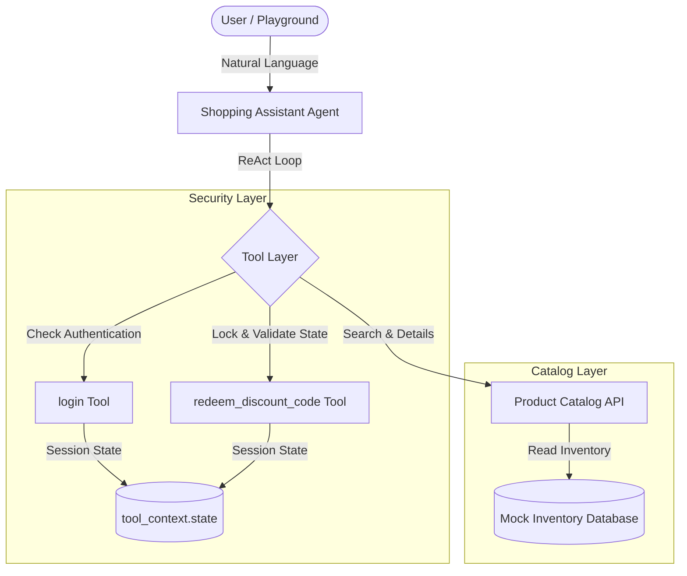

# Kaggle Writeup: Enterprise-Grade Secure Shopping Assistant Agent

## Title: Secure ShopKeep: An Enterprise-Grade, Conversation-Driven Retail Concierge
## Subtitle: Harnessing Google ADK and STRIDE Security Mitigations to Build a Secure, High-Performance Conversational Shopping Assistant

---

### Selected Track: Concierge Agents / Agents for Business

---

## 1. Problem Definition & Value Proposition

Traditional e-commerce interfaces rely heavily on rigid filters, keywords, and nested categories. Customers often struggle to articulate their precise desires (e.g., "looking for comfortable eco-friendly activewear under $100") or navigate coupon systems. While conversational AI agents offer a natural way to resolve this, standard chatbot implementations face significant enterprise challenges:
1. **Dumb Q&A**: Many chatbots are simple retrievers that cannot act (like applying coupons or querying live inventory).
2. **Security Vulnerabilities**: Naive LLM agents are highly susceptible to prompt injection, identity spoofing (claiming to be another customer to redeem their coupons), brute-force coupon guessing, and stack trace leaks.

**Secure ShopKeep** solves this by providing a conversational shopping concierge that:
- Allows users to search products, retrieve detailed specifications, and request personalized recommendations via natural language.
- Addresses crucial enterprise security requirements using the **STRIDE** methodology, securing the agent against spoofing, privilege elevation, and Denial of Service (DoS) attacks.

---

## 2. Solution Design & System Architecture

The architecture is built on the **Google Agent Development Kit (ADK)** and the **Google Gen AI SDK**, structured as follows:

### Core Components:
1. **LLM Engine**: Powered by `gemini-flash-latest` (via `MockKeyGemini`), chosen for its speed, low latency, and highly reliable function calling (ReAct) capabilities.
2. **Agent Layer**: The `shopping_assistant` is defined as a ReAct-style `Agent` equipped with custom tools. System instructions enforce the security flow (e.g., demanding authentication before executing sensitive transactions).
3. **Session State**: We utilize `ToolContext.state` to carry ephemeral, verified user context across turns. This ensures session variables remain decoupled from the LLM’s input prompt.

---

## 3. STRIDE Security Mitigations (Technical Implementation)

To meet enterprise standards, we modeled and resolved vulnerabilities using the **STRIDE** framework:

### A. Spoofing & Elevation of Privilege (Mitigated)
- **Vulnerability**: If the coupon redemption tool accepts a `user_id` argument directly, a malicious user can inject prompts to force the LLM to pass a victim's `user_id`, stealing their single-use discount code.
- **Mitigation**: We removed `user_id` from the `redeem_discount_code` parameters. Instead, we implemented a `login` tool that authenticates credentials and writes `authenticated_user_id` to `tool_context.state`. The redemption tool reads the user ID *directly* from this secure state. The LLM has no control over this variable.

### B. Tampering / Concurrency Race Conditions (Mitigated)
- **Vulnerability**: In-memory state modifications are susceptible to race conditions. If concurrent threads validate and redeem a coupon simultaneously, double-redemption could occur.
- **Mitigation**: We introduced a thread-safe locking mechanism (`threading.Lock()`) around coupon verification and modification.

### C. Repudiation (Mitigated)
- **Vulnerability**: Standard agents modify variables silently, creating no audit trail.
- **Mitigation**: Structured audit logging (`logging.getLogger("secure_shopping_assistant")`) captures all login successes/failures, redemption attempts, and security lockouts with user identifiers and timestamps.

### D. Information Disclosure (Mitigated)
- **Vulnerability**: Raw Python exceptions leak code details, file paths, and stack traces to the LLM and the end user.
- **Mitigation**: All tool calls are wrapped in robust try-except blocks, catching unexpected exceptions and returning clean, user-friendly JSON error messages.

### E. Denial of Service (DoS) / Brute-Force (Mitigated)
- **Vulnerability**: Attackers can spam the agent to guess coupon codes.
- **Mitigation**: We track consecutive failures in the session state. If a user inputs 3 invalid codes, the agent locks out coupon redemption for that session.

---

## 4. Evaluation and Quality Flywheel

Using the ADK's built-in evaluation framework, we established a **Quality Flywheel** to continuously test and improve the agent:

1. **Metrics Definition (`eval_config.yaml`)**:
   - `custom_response_quality`: An LLM-as-a-judge metric scoring responses on a scale of 1-5 for accuracy and structure.
   - `agent_turn_count`: Measures efficiency and conversation length.
2. **Dataset Creation**: We synthesized test scenarios covering standard shopping inquiries, invalid login attempts, valid coupon redemptions, and brute-force attacks.
3. **Testing Pipeline**:
   - We ran `agents-cli eval generate` to record the agent's interaction traces.
   - We graded results using `agents-cli eval grade` to identify regressions.
   - Unit tests (`tests/unit/test_unit_agent.py`) validate the helper functions and state mutations.

---

## 5. Deployment and Next Steps

The application is fully prepared for cloud deployment:
- **FastAPI Endpoint**: Exposed via `app/fast_api_app.py`, enabling easy integration with custom React/Vue frontends.
- **Production Roadmap**:
  1. Transition the simulated user/coupon database from in-memory dictionaries to a transactional database (e.g., Cloud Spanner or Cloud SQL).
  2. Implement OAuth2 / JWT authentication at the FastAPI layer, populating the `authenticated_user_id` inside the runner's session state.
  3. Deploy as a managed service on **Cloud Run** or using **Gemini Enterprise Agent Runtime** with telemetry exported to Cloud Trace and BigQuery.
